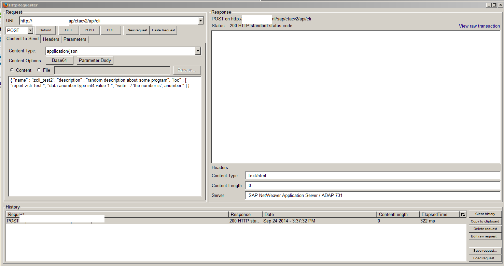
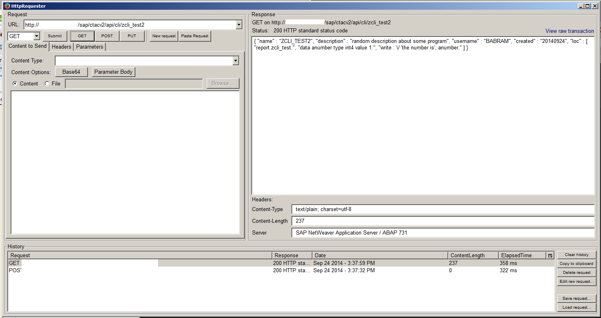
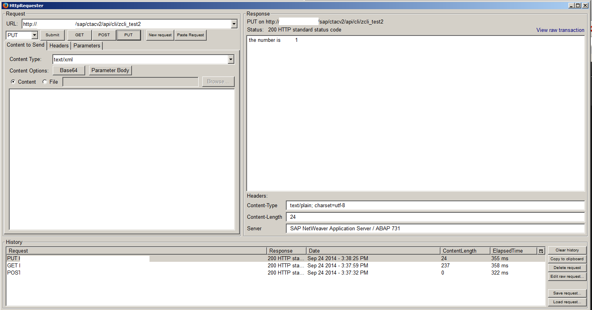

abap-cli
========

An ABAP web resource for developing an ABAP report outside of SAP. The code can be saved, ran, and retreived. 

## Create a Report (HTTP POST)

## View a Report (HTTP GET)

## Run a report (HTTP PUT)

